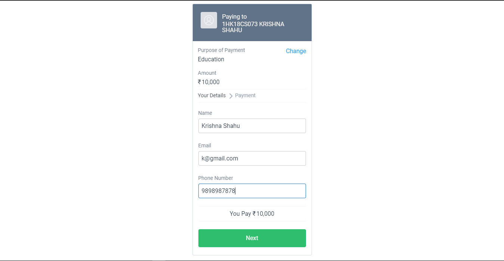
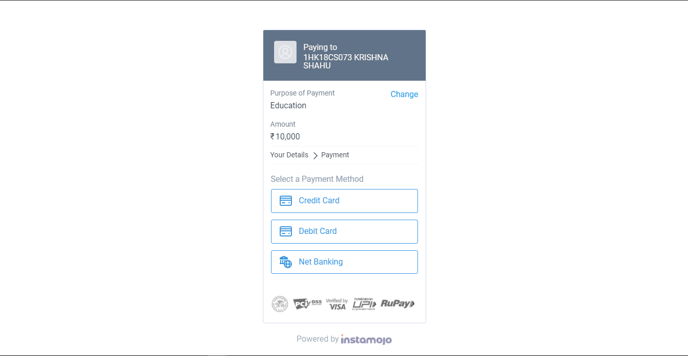
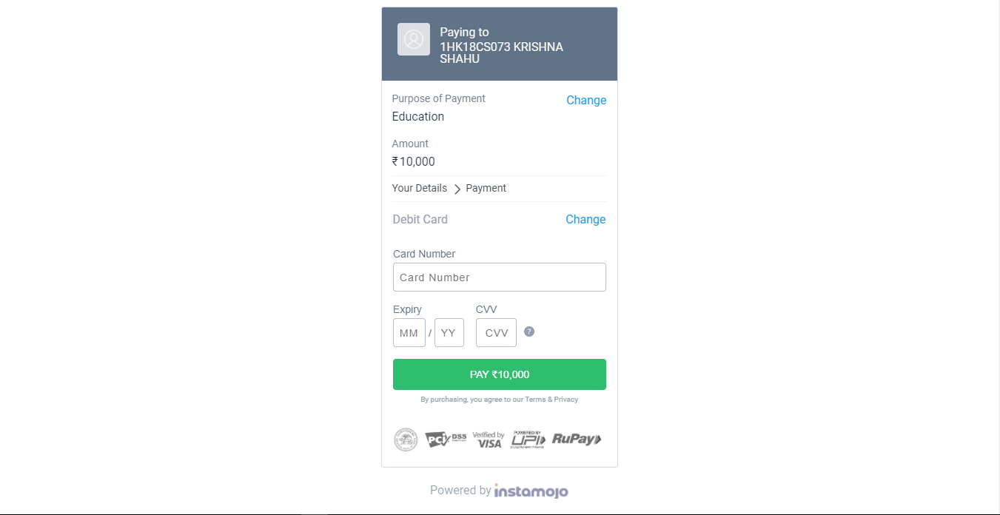
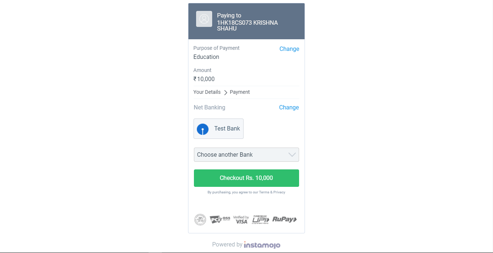
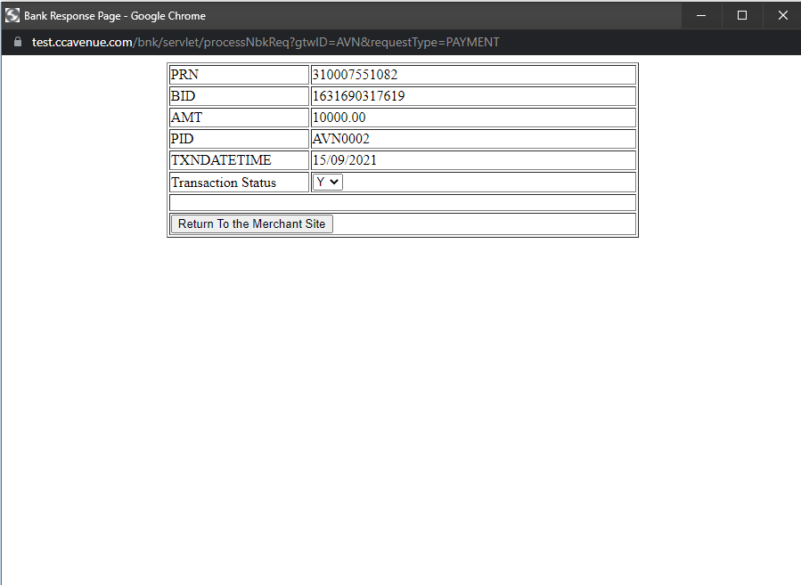
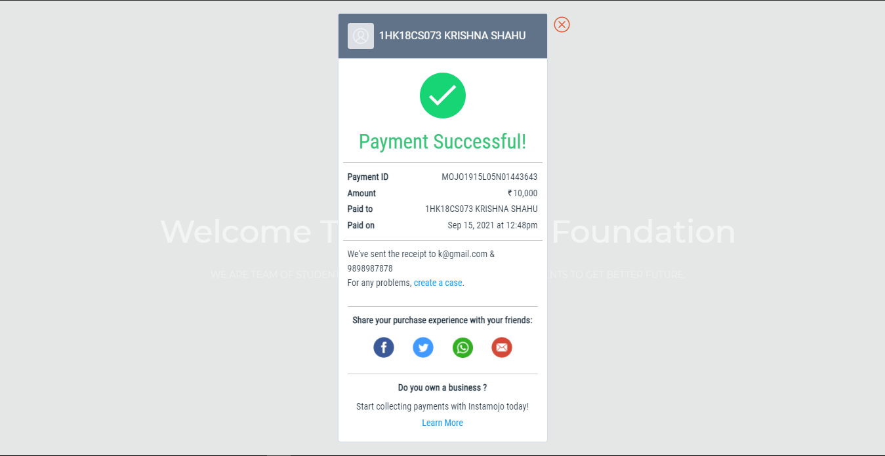

# Task: PAYMENT GATEWAY INTEGRATION
An internship project at The Sparks Foundation
<ul>
  <li>I have added payment gateway using Instamojo</li>
  <li>It supports payments using credit card, debit card and net banking.</li>
  <li>The payment gateway also sends an email and a receipt to receipient's email.</li>
</ul>
<h2>Website Link</h2>
  <a href="https://krishshah920.github.io/knightfoundation/">The Knight Foundation</a>
  
  
  <h2>Snapshots</h2>
  
  
  
  
  
  
  
  

